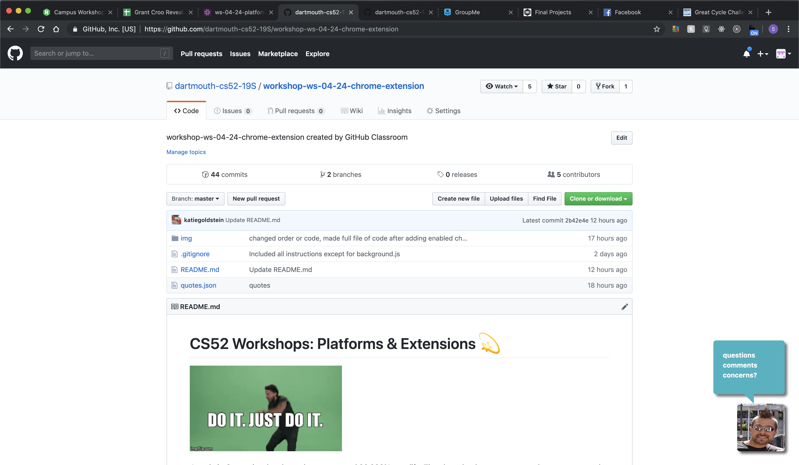
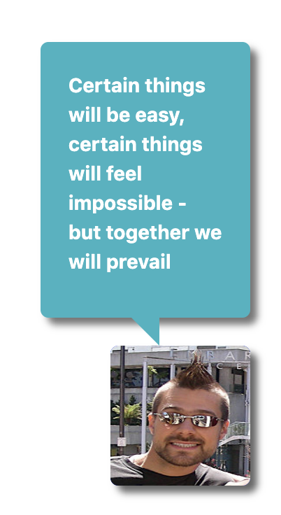
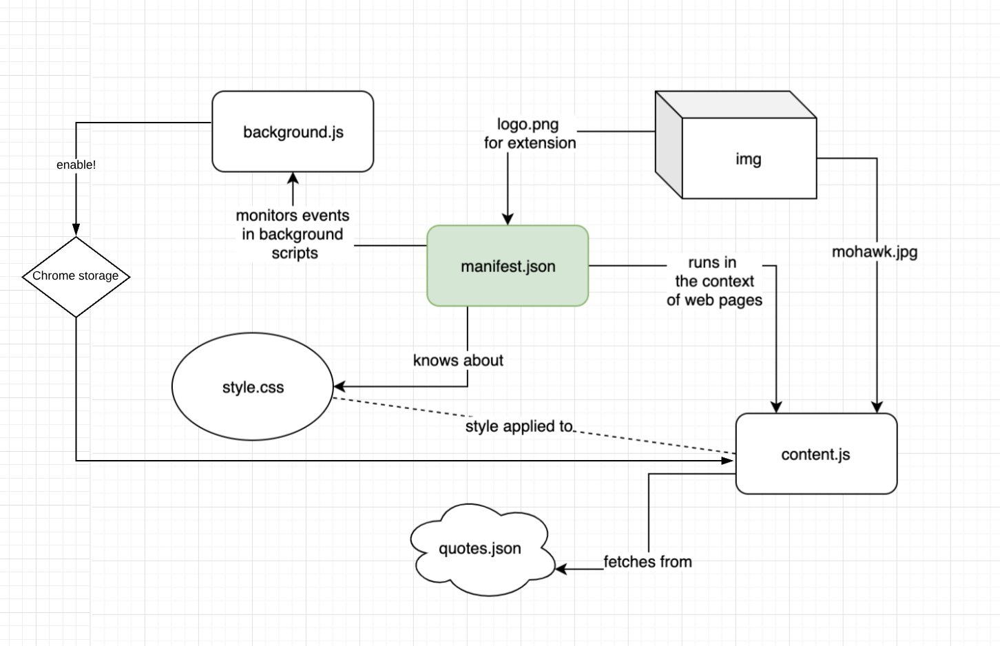
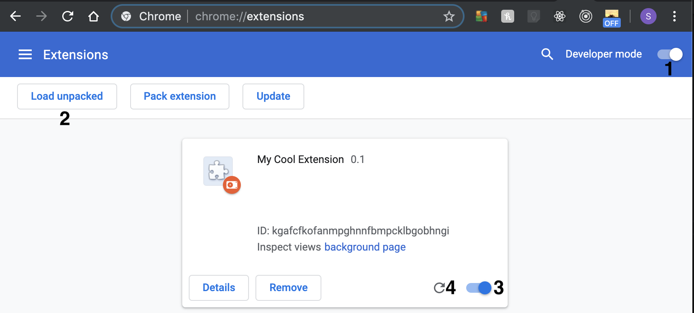

# CS52 Workshops:  Platforms & Extensions :dizzy:


Just do it. Customize the place where you spend 99.999% your life. The place that burns your eyes when you try to code a new website.

# Overview :star:
Chrome extensions allow the user to customize chrome with silly add-ons to productivity increasing ones. We’ll walk through building one that falls closer to the silly side than the productive one. Some of our favorites include: 
* [Shia Lebeouf](https://chrome.google.com/webstore/detail/just-do-it/pdnkdpkigplndkpnciommmacnplfjbal?hl=en) - just do it. 
* [React Developer Tools](https://chrome.google.com/webstore/detail/react-developer-tools/fmkadmapgofadopljbjfkapdkoienihi?hl=en) helps with debugging react. 
* [GitCheat Sheet](https://chrome.google.com/webstore/detail/git-cheat-sheet/mjdmgoiobnbkfcfjcceaodlcodhpokgn) for easy access to common Git commands and terminology.
* [DarkReader](https://chrome.google.com/webstore/detail/dark-reader/eimadpbcbfnmbkopoojfekhnkhdbieeh) Dark mode for every website.
* [Sitemod.io](https://chrome.google.com/webstore/detail/sitemodio/efjbaneaebkanjmhengnedpllfdiocin?ref=producthunt) allows you to modify and save changes to any website you visit, with cleaner source code than you’ll find in the chrome developer tools. 

Chrome extensions can access all the API’s that a webpage might and some additional ones for interacting with chrome in ways that only extensions can. Extensions are set up much like a webpage, using js, html and css. Just like websites, extensions have a huge range of possibilities. 

A chrome extension is a simple and fun way to spruce up your browsing experience, which is where most of us spend our lives, so why not make it yours. It is also the perfect platform for certain projects, the most obvious ones being those that change how we interact with websites or entertainment ones where in-browser is just the right medium.




Today we'll make an extension that looks like this. Yup, that's Tim and those are all quotes from his presentations. They'll stay with you when you need some motivation on our labs or crushing your final project. The quotes display randomly, but after you are done you'll be able to change the extension to show whatever quotes you want, in whatever order, and with whatever picture you want. But for now let's get started :grin:. 

## Disclaimer :no_good:
Spaces, commas, semi-colons and other syntactical issues will come up if you are not careful! This is our warning to you to **make sure to think through the code** and **TRY NOT TO JUST COPY AND PASTE**!

# Setup :star:

:fork_and_knife: You can fork this repo to get started. 

It doesn't contain any functional code, but it does include the images that we'll refer to, a ```.gitignore``` file, and the quotes.



Chrome extensions are created with a couple files: 
* ```manifest.json```: Tells chrome what scripts, resources, and permissions the extension uses. 
* ```content.js```: Contains the actual base functionality of the extension, like adding a div to the screen or replacing all ``````. 
* ```background.js```: Listens for browser events, like reloading the page or clicking the on off button. 
* ```style.js```: Style your additions with some standard CSS. 
* Any source files: Images, quotes, any information that your extension includes or uses. (You can also get information from web APIs.).


## Reminder about JSON :sunglasses:
JSON files store objects. They use the same notation as javascript, except they always put variables/values in quotes ```"somekey": "somevalue"```. Arrays are  indicated with ```["entry1", "entry2"]```. Objects with ```{"key": "value"}```

Object: 
```json 
{
    "greeting": "hello, this will be fun.",
    "quotes": [
        "you got this",
        "it's not just copy paste",
        "but you can do it"
    ]
}
```

## Debugging Steps :bug:
1. What kind of file? JS, JSON, CSS?
    * JS: is everything in the right place, is the function completed? 
    * JSON: probably missing a comma or you adding something in the wrong spot. Are things in the arrays they should be? How about in the objects?
    * CSS: You know how to do this!
2. Did you refresh the extension? Remember chrome://extensions/ !
3. Run it on [Dartmouth.edu](https://home.dartmouth.edu/) (Some websites don't play nice.)


# Add Functionality :star:

## Manifest File :boom:
To start with creating any Chrome extension, we need a ```manifest.json``` file. 

:floppy_disk: In your workshop directory, create ```manifest.json``` and add the following code block:

```json
{
   "manifest_version": 2,
   "name": "Tim's Thoughts",
   "version": "0.1",
   "browser_action": {
       "default_icon": "img/logo.png"
   },
}
```

You should have an img directory from when you forked this repo and it should contain logo.png. This will be the image that shows up inour chrome toolbar!

This is the initial setup for any chrome extension. In order for the logo png to show up, our extension needs to know that it’s loading those images. Add the below code block to the ```manifest.json``` file underneath the manifest_version code block: 

```json
"web_accessible_resources": [
       "*.jpg",
       "*.jpeg",
       "*.png",
       "*.json",
       "*.png/",
       "*.jpg/"
     ]
```
Now all the images ending with those listed would be able to show up whenever the extension uses them.

## Content File :information_desk_person:
Great! But how does our extension know what to do specifically? 

We can tell it by making a ```content.js``` file that will hold the actual actions of the extension. 

For this extension, we are making a quote bot with Tim's photo! The content file is specified in ```manifest.json``` so that the browser knows to run the script. 

First, add ```content.js``` as a content script in ```manifest.json``` so it knows to load it:

```json
"content_scripts": [
    {
        "matches": [
             "<all_urls>"
        ],
        "js": ["content.js"]
    }
]
```
```content.js``` is our main js file and describes the behavior of the extension. Note that in ```“matches”``` the ```“<all_urls>”``` is a descriptor telling chrome that our extension applies to all urls and should always run. 

Now that chrome will look to run ```content.js``` we have to create it. 

:floppy_disk: Create ```content.js``` in your root directory. Let's test it, inside ```content.js``` add an alert (or a console log):

```javascript
alert("Hello from your Chrome extension!");
```

How do we see this test? We upload our extension. 

## Testing your extension<sup id="fnl1">[1](#fn1)</sup>
Now it's time to upload our extension to chrome! Go to chrome://extensions (copy-paste into Chrome)



1. Turn on *Developer mode* in the upper right hand corner. 

2. Click on *Load Unpacked* and select the directory that contains your chrome extension.

3. Make sure the extension is turned on (toggle is blue). This is where errors in the extension will be logged.  
    * :question: If there is an **error** in the code, it will give you an error message and not let you turn the extension on. Whenever you have an error, it is convenient to *clear the error* before reloading to make it clear if the error is from your newest change or just leftover. Wave us down if you have questions!

4. <a id="refresh"></a>:warning: From now on, in order to view your edits, you have to refresh the extension on (chrome://extensions).

:white_check_mark: Check your progress out! Open a new tab and navigate to another website. We recommend [dartmouth.edu](https://home.dartmouth.edu/). Your alert should popup! 


:exclamation: If this still doesn't work, try [google.com](https://google.com/)! 

## Actual Logic :metal:
TBH this alert is kinda annoying. We want to make our own sprite quote bot. 
What does this involve?
1. Loading an image on the screen
2. Adding quotes to it

Working in ```content.js```...

### Add an image :foggy:
In order to add the image to the current page, we'll use some js. Take a stab at adding a div and img to the body of the html document, just like you would in a main javascript file for a normal page. This is just like your quiz!

We have included some images in ```img/```, feel free to add your own photo or just use ```img/mohawk.jpg``` 
. 

<details>
    <summary>Hints:</summary> 

* create a variable to store your addition
* set its inner html to be a div and image
* append it to the body of the document

</details>

<details>
  <summary>Ok, I tried. Show me the answer</summary>

```javascript
    var div = document.createElement("div");
      var imgPath = chrome.extension.getURL('img/mohawk.jpg');
      div.innerHTML = `
      <div id="clippy"></div>
          
      `;
      document.body.appendChild(div);
```

</details>

### Styling break :sparkling_heart:
Phew, let's ditch the js for a second and make that image actually show up on the screen. Feel free to style it how you want or copy our styling.

You also have to make sure the extension knows to load the style sheet.

<details>
<summary>Where should you put this line of code: "css": ["style.css"]?</summary>

In ```manifest.json``` under ```content_scripts```!

```json
"content_scripts": [
        {
        "matches": [
            "<all_urls>"
        ],
        "js": ["content.js"],
        "css": ["style.css"]
        }
    ],
```
</details>

:floppy_disk: Ok, now time to make a ```style.css``` in root directory.
If you're making your own style, make sure to have styling for:
* the icon image (#clippyImg)
* the Speech Bubble that will contain the quote (#speech-bubble, #speech-bubble:after)

<details>
    <summary>Our Style</summary>

```css
#clippyImg{
    width: 100px;
    height: 100px;
    position: fixed;
    bottom: 0;
    right: 0;
    margin: 30px;
    background-color: blue;
    border-radius: .4em;
    box-shadow: 5px 5px 5px #666;
 }
 
 #speech-bubble {
    background: #00aabb;
    color: white;
    font-weight: bold;
    border-color: black;
    opacity: 0.9;
    border-radius: .4em;
    width: 150px;
    position: fixed;
    bottom: 150px;
    right: 30px;
    padding: 20px;
    box-shadow: 5px 5px 5px #666;
 }
 
 #speech-bubble p{
    opacity: 1;
 }
 
 #speech-bubble:after {
     content: '';
     position: absolute;
     bottom: 0;
     left: 50%;
     width: 0;
     height: 0;
     border: 20px solid transparent;
     border-top-color: #00aabb; 
     border-bottom: 0;
     border-right: 0;
     margin-left: -10px;
     margin-bottom: -20px;
 }
 ```

 </details>

Cool, you should now see the image when you open a new tab. (Remember to [refresh](#refresh) the extension.) 

:thumbsup: Feel free to comment out the alert at this point. 


### Add Quotes :speech_balloon:
Now, just a picture of Tim, though worth a thousand words, is worth more when it includes a pearl of wisdom he dropped in class. Fear not, we have compiled some *inspirational* quotes from class. You’ll find them in a json file called quotes. 

This will have two main parts: 
1. Loading the quotes
2. Picking a quote to display and adding it to the div

#### Loading Quotes :page_with_curl:
Start with loading them from the ```quotes.json``` file in ```content.js``` with the ```fetch(URL)``` method. The [fetch](https://developers.google.com/web/updates/2015/03/introduction-to-fetch#fetch) method returns a promise with the requested results. 

Here is an **example** of proper fetch use from google (emphasis on **example**): 

```javascript
fetch('./api/some.json')
  .then(
    function(response) {
      if (response.status !== 200) {
        console.log('Looks like there was a problem. Status Code: ' +
          response.status);
        return;
      }

      // Examine the text in the response
      response.json().then(function(data) {
        console.log(data);
      });
    }
  )
  .catch(function(err) {
    console.log('Fetch Error :-S', err);
  });
``` 

Try using this method to fetch the quotes and save them.

<details>
    <summary>Ok, so maybe you’d prefer to copy and paste…THAT’S why yOu NEED this ExTimsion. :triumph: </summary>

```javascript
        // load the quotes from the json file
        const quotesURL = chrome.runtime.getURL('quotes.json');
        var quotes;
        fetch(quotesURL).then((response) => response.json())
            .then((json) => {
                quotes = json;
            })
            .catch((error) => console.log(error, error.message));
```
</details>

#### Say Quote :speak_no_evil:
Alright, so you got the quotes. Now what? Let's pick one at random and update the sprite to say it at a random interval. 

Create a function to randomly pick and append a quote from the quotes passed as its argument whenever called. 

<details>
<summary>Yup, we hid this solution too. "Be the webdev!"</summary>
<details><summary>Just one more try?</summary>

 ```javascript
 function sayQuote(qts) {
    var quote = qts.quotes[Math.floor(Math.random() * qts.quotes.length)];
    document.getElementById("clippy").innerHTML = `<div id="speech-bubble"><p>${quote}</p></div>`;
    console.log(quote);
}
 ```
 </details>

 </details>

Where should we call this function? :stuck_out_tongue_closed_eyes:

How about as soon as we load the quotes in ```content.js```. 

```javascript
// load the quotes from the json file
        const quotesURL = chrome.runtime.getURL('quotes.json');
        var quotes;
        fetch(quotesURL).then((response) => response.json())
            .then((json) => {
                quotes = json;
                // say one right away
                sayQuote(quotes);
                // set an interval with some randomness to update the quote
                setInterval( () => sayQuote(quotes), 5000 + Math.random()*3000);
            })
            .catch((error) => console.log(error, error.message));
```


Here we fetch the json file, call the function immediately, and invoke the function periodically.

Now you have a working chrome extension, except it is always on… And maybe at a certain point you’d rather have Shia Lebeouf yell at you than read a pearl of CS52 wisdom. 
On to making the on off button! 

# On and Off Button :no_entry_sign:
To create a button we'll need access browser events, specifically the click when the user clicks on the on off button. To access browser events, like clicks, in a chrome extension, the extension needs another file, a background file that listens for events and responds to them. Once on-off button responds to clicks, we will utilize in browser storage to pass the on-off state to the content script. 

## Background File 
The background file listens for browser events and acts on them. It can send information to other files via messages or set browser storage. In our case, it just listens for user clicks on the extension’s button in the toolbar (top right of your browser). 

### Manifest Setup :boom:
Add the background script to ```manifest.json```
```json
   "background": {
       "scripts": ["background.js"]
     },
```

Additionally, the extension requires permission to access the current tab, the browswer storage, notification and any webpage. 
```json
"permissions": [
       "tabs",
       "storage",
       "notifications",
       "http://*/",
       "https://*/"
     ]
```
The permissions have to be declared for the program to access these items and so that the user knows what the extension can access.

### Background Logic :foggy:
:floppy_disk: Then create a ```background.js``` file.

The first thing that our background file can do is set some text on the extension's logo to indicate whether it is on or off: 
```javascript
//Setting badge/button of the extension.
chrome.browserAction.setBadgeText({ text: 'OFF' });
```

Next we'll set the default state for ```enable``` to ```false``` for *off* and we'll store it in [Chrome Storage](https://developer.chrome.com/apps/storage). By storing it in Chrome storage, we'll be able to access it in the content script.
```javascript
// boolean for on/off 
var enable=false;
// store enable in local storage if you wanted to access in content.js
chrome.storage.sync.set({"enable": enable});
```

:question: What do we have to do when the user turns the extension on or off? If this were and ```onClick``` method in react, what would you do?

We will need to:
* toggle the value of ```enable```
* update the text on the logo to indicate the state
* save the value of enable so that we can access it in ```content.js```. (We'll want either run the content script functionality or not based on the value of ```enable```.)
You were right!

We use ```chrome.browserAction``` to both read events and set the badge, like above. We also use ```chrome.tabs.executeScript``` to reload the page. 

You can probably think through the pseudo code for this function, but we've included the code here since it's a bit heavy with new syntax for the chrome API. :muscle:

```javascript
// onclick method
chrome.browserAction.onClicked.addListener((tab) => {
    enable = !enable;
    // if enabled run content.js else, reload page
    if (enable) {
        chrome.browserAction.setBadgeText({text: 'ON'});
        chrome.tabs.executeScript(null, { file: 'content.js'});
    } else {
        chrome.browserAction.setBadgeText({ text: 'OFF'});
        chrome.tabs.executeScript(tab.id, {code: 'window.location.reload();'});
    }

    // store state of button
    // with callback for debugging
    // chrome.storage.sync.set({"enable": enable}, () => console.log('Enable set to: ', enable));
    // w/o callback 
    chrome.storage.sync.set({"enable": enable});
})
```


### Incorporate into **Content Script**
Now we only want the content script to run when the extension is enabled. In ```background.js``` we stored the variable ```enable``` in the browser storage, so that we can get it in the ```content.js``` script using the [storage sync](https://developer.chrome.com/apps/storage) API. The storage API syntax is: 

```javascript
chrome.storage.sync.get("enable", function(result) {
    ...
}
``` 

Since this method returns a promise, we need to put our content functionality inside of the callback. 

Go into your ```content.js```. All of our functionality should be inside a check of enable, except ```sayQuote()``` which can be defined outside as it is just a function we are using.

So put all of your logic for adding the image, loading the quotes, and calling ```sayQuote()``` inside the callback and only run when ```enable == true```. Give it a go and see if you can get it to work. 

<details>
<summary>Hidden again? You've got to be kidding me...</summary>

Once you are done, your ```content.js``` should look like this:

```javascript
// alert("Hello from your Chrome extension!");

// if you want to use storage from chrome, you can access this way: 
chrome.storage.sync.get("enable", (res) => {
    // if enabled run
    if (res.enable) {
        // add the div for the quotes and the image the page
        var div = document.createElement("div");
        var imgPath = chrome.extension.getURL('img/mohawk.jpg');
        div.innerHTML = `<div id="clippy"></div>
                            `;
        document.body.appendChild(div);
    
        // load the quotes from the json file
        const quotesURL = chrome.runtime.getURL('quotes.json');
        var quotes;
        fetch(quotesURL).then((response) => response.json())
            .then((json) => {
                quotes = json;
                // say one right away
                sayQuote(quotes);
                // set an interval with some randomness to update the quote
                setInterval( () => sayQuote(quotes), 5000 + Math.random()*3000);
            })
            .catch((error) => console.log(error, error.message));
        
        
    }    

});

// Pick a random quote and add it to the page
function sayQuote(qts) {
    var quote = qts.quotes[Math.floor(Math.random() * qts.quotes.length)];
    document.getElementById("clippy").innerHTML = `<div id="speech-bubble"><p>${quote}</p></div>`;
    console.log(quote);
}

```
</details>

Now your extension should only show up and display quotes when you turn it on in the toolbar! Woohoo!! 

**So**:exclamation:

**Much**:exclamation::exclamation:

**Motivation**:exclamation::exclamation::exclamation:

# Publish :stuck_out_tongue_closed_eyes:
You can use the steps above to run the extension in your own browser, but actually publishing the extension takes a bit more work and :money_with_wings:, so we won't cover it here, but if you are interested here are the [Chrome instructions for publishing an extension](https://developer.chrome.com/webstore/publish).


<!-- # Uploading Your Extension*
Link to Chrome Extensions
Now it's time to upload our extension to chrome!

* Go to [chrome://extensions](chrome://extensions/) and make sure *Developer mode* in the upper right hand corner is toggled on.


* Click on *Load Unpacked* and select the directory that contains your chrome extension.


* Make sure you turn on chrome extension. If there is an error in the code, it will give you an error message and not let you turn it on.  


:white_check_mark: Check-in! Navigate to another [website](https://home.dartmouth.edu/) (load a new tab) and inspect the page. In the console, your previous ```console.log``` statement should now appear!


*this section is a direct quote from [last year’s workshop group](https://github.com/dartmouth-cs52-18S/workshop-ws-chrome-extension/blob/master/README.md). 

* In order to view your edits you have to refresh the extension on (chrome://extensions). -->


# Summary / What you Learned :clock10:

* [X] What a Web Platform is 
* [X] Basic understanding of Electron
* [X] Basic understanding of Chrome Extensions
* [X] How to code your own Chrome exTIMsion

You just learned how to make your own chrome extension! Hopefully, it was a painless experience :laughing:. You can use it to create fun extensions like this or to make more powerful ones to change how you browse the web. 

Chrome extensions work similarly to websites and can access most of the APIs that a website could. Just like websites they do require a couple different files, but most of the functionality happens in one or two base js files. 

:fire: Hot tip: If you don't want this exTIMsion, right click the logo in the chrome toolbar and click ```remove from chrome```.

# Extra Credit :100:
* Customize!! Change up the sprite image, the quotes your sprite says, the logo in the chrome toolbar, anything.
* Have your sprite say different quotes on certaint events (creativity appreciated)
* Figure out how to position the sprite on websites that are built in interesting ways (on slack, google slides, etc.)

# Reflection :interrobang:
1. How do all of the chrome extension files interact?
2. Why would you want to use the chrome extension platform for a project instead of making a standalone website, app, or desktop app? 

Remember to submit whatever you have, as well as *short* reflection answers, on Canvas!

# Resources :link:
* [Chrome Extensions Development Page](https://developer.chrome.com/extensions)
    * [Chrome Overview of Extensions](https://developer.chrome.com/extensions/overview)
    * [Chrome Getting Started with Extensions](https://developer.chrome.com/extensions/getstarted)
* [Chrome instructions for publishing an extension](https://developer.chrome.com/webstore/publish)
* [Chrome Storage](https://developer.chrome.com/apps/storage)
* [Chrome Extensions with Vanilla JS] (https://medium.com/javascript-in-plain-english/https-medium-com-javascript-in-plain-english-how-to-build-a-simple-chrome-extension-in-vanilla-javascript-e52b2994aeeb) 

# Sources
<a id="fn1">1</a>The extension loading section is basically copied from [last year’s workshop group](https://github.com/dartmouth-cs52-18S/workshop-ws-chrome-extension/blob/master/README.md). [↩](#fnl1)
Our idea is also closely related to their idea --> we all love Tim. 

We also used the [clippy extension](https://chrome.google.com/webstore/detail/clippy-the-useless-paperc/fmbcdhjmhddnnpeomknikdbboejbhdcl?hl=en-US) to start working through building the extension and for the idea. 

The tutorial is also inspired by [this other tutorial on creating Chrome extensions from scratch](https://thoughtbot.com/blog/how-to-make-a-chrome-extension)
